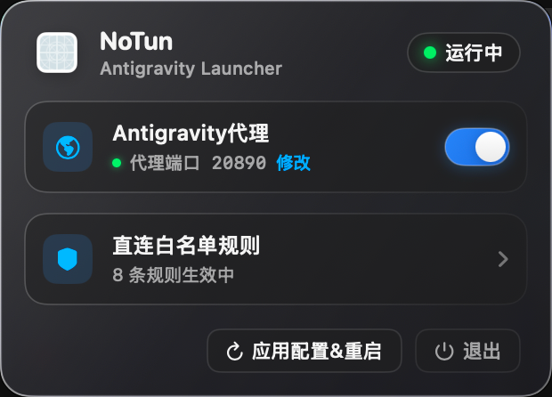
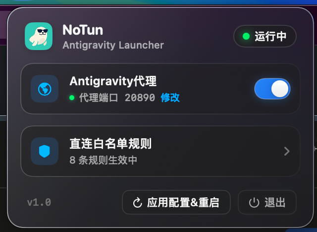

<!-- 居中 Logo 与标题 -->
<p align="center">
  <a href="https://github.com/ctvc01/NoTun4Antigravity">
    
  </a>
</p>

<h1 align="center">NoTun4Antigravity</h1>

<p align="center">
  <!-- 扁平化状态徽章 -->
  <a href="https://github.com/ctvc01/NoTun4Antigravity/stargazers"></a>
  <a href="https://github.com/ctvc01/NoTun4Antigravity/releases"></a>
  
  
  
  <a href="LICENSE"></a>
</p>

<p align="center">
  <b>专为 Google Antigravity 打造的 macOS 极简启动与网络加速助手。</b><br>
  告别全局 TUN 虚拟网卡劫持，实现进程级精准代理注入与企业内网直连加速。
</p>

---

<!-- 视觉证据 (原生控制中心暗黑预览图) -->
<p align="center">
  
</p>

## 💡 为什么选择 NoTun4Antigravity？ (Why NoTun?)

传统的代理工具开启 **TUN / VPN 模式** 会创建系统级虚拟网卡，强制劫持整台 Mac 的所有网络请求，往往引发内网断连、公司安全告警或日常软件卡顿。

**NoTun4Antigravity** 采用 **L7 应用层进程定向注入技术**，仅在拉起 Antigravity 时注入代理环境，其他应用完全保持纯净直连。

### 📊 方案对比矩阵 (Comparison)

| 对比维度 | 传统代理工具 (开启 TUN / VPN 模式) | NoTun4Antigravity (免 TUN 进程定向注入) |
| :--- | :--- | :--- |
| 🏢 **企业内网与 VPN** | 易与公司 VPN / SSO 认证冲突，导致内网管理后台、GitLab、跳板机断连 | 🟢 **100% 物理隔离**，内网工具与公司 VPN 丝毫不受影响 |
| 💬 **办公与音视频会议** | 腾讯会议 / 飞书 / Zoom 的 UDP 流量易被接管，造成卡顿或断流 | 🟢 **原生低延迟**，办公通讯完全走本地物理网卡 |
| 🍎 **系统服务与生态** | iCloud 同步、App Store、AirDrop / AirPlay 无故消耗代理流量 | 🟢 **零流量浪费**，macOS 系统服务 100% 直连 |
| 🐳 **本地开发与微服务** | Docker 容器互联、`localhost` 本地端口易发生回环死锁与证书报错 | 🟢 **纯净开发环境**，本地端口与调试流量互不干扰 |
| 📺 **国内日常流媒体** | 网易云、B站、爱奇艺易受境外 IP 限制，大文件下载易耗尽节点流量 | 🟢 **国内原生千兆**，日常娱乐与下载跑满物理宽带 |
| 🛡️ **系统级稳定性** | 虚拟网卡驱动崩溃可能导致“整台 Mac 彻底断网瘫痪” | 🟢 **零系统侵入**，无虚拟网卡驱动，系统网络永久安全 |

---

## ✨ 核心特性 (Features)

* 🎯 **进程级精准代理**：告别 TUN 虚拟网卡劫持，仅对 Antigravity 注入代理环境变量。
* 📊 **测速质检与真实通信校准系统 (v1.6)**：首创双轨日志交叉比对引擎，记录 Antigravity 实际 IDE 请求与测速探活指标，自动识别并拦截“测速显示全通但实际 502 断连”的节点虚高误报，并计算加权可用性参考分。
* 🪟 **类 macOS 控制中心原生单窗体交互 (v1.4)**：告别任何弹出独立窗口的繁杂体验，端口设置、节点真机测速与直连白名单全部收敛于主面板内，通过 Apple 弹簧阻尼实现丝滑侧滑推入与返回（支持 `Esc` 键瞬时返回）。
* 🛡️ **内存级系统网络代理守护与自愈 (v1.5)**：0.05ms 微秒级无感知内存轮询，自动并集合并系统代理白名单，无缝解决 FlClash/Clash 误冲内网白名单引发的 502/断网难题，全生态加白携程内网与飞书/Lark。
* 🧊 **macOS 液态玻璃控制中心**：基于 SwiftUI 原生打造，深度融合 macOS 控制中心设计工程学（Emil Kowalski 弹簧触觉与光学排版）。
* 🧭 **自动代理端口自适应**：智能侦测 macOS 系统实际代理端口（自适应端口漂移），彻底告别因客户端端口变更引发的假死断网。
* ⚡ **全链路 AI 探活三矩阵**：并发深度探测 Gemini API 模型通道、CloudCode 调度通道与 OAuth2 令牌刷新通道，精准排查“运行两步即断开”的断连元凶与 TLS 握手损坏。
* 🛡️ **单主开关全能聚合**：遵循极简设计（Ponytail 原则），将动态端口感知、进程环境变量注入、本地 IDE `settings.json` 防死锁托管、SSH 心跳防断连与 QUIC 阻断完全聚合于单个主开关，后台静默自愈，零心智负担。
* 📡 **Agent 长连接高频保活**：彻底阻断 QUIC (UDP 443) 握手黑洞，注入 `GRPC_KEEPALIVE` 智能心跳，解决 Agent 工具执行停顿期连接被中间节点掐断的顽疾。
* 🛡️ **智能内网直连白名单 (`NO_PROXY`)**：支持多行自定义域名、IP 与 CIDR 网段，并自动双向同步至 macOS 系统网络代理忽略列表，浏览器与工具均享内网直连。
* 🔄 **安全热重启与即刻生效**：修改端口或白名单时支持安全热重启，平滑退出并以全新网络参数干净拉起 Antigravity。
* 🚀 **现代 Swift 6 架构**：全面适配 Swift 6 严格并发检查（Strict Concurrency Checking），零警告、极致轻量低功耗。

---

## 🚀 快速上手 (Quickstart)

### 方式一：直接下载使用 (推荐)

前往 [Releases 页面](https://github.com/ctvc01/NoTun4Antigravity/releases) 下载最新版本的 `NoTun4Antigravity.dmg`，拖入 `Applications` 文件夹即可打开。

### 方式二：从源码构建

```bash
# 1. 克隆项目仓库
git clone https://github.com/ctvc01/NoTun4Antigravity.git

# 2. 打开 Xcode 工程
cd NoTun4Antigravity && open NoTun4Antigravity.xcodeproj

# 3. 按下快捷键 ⌘ + R 即可编译并运行常驻菜单栏
```

---

## 📖 使用指南 (Usage)

启动应用后，点击 macOS 菜单栏常驻的海豹图标，即可呼出控制中心：

<p align="center">
  
</p>

1. **状态检查与一键守护**：确认「全局代理与环境守护」主开关开启（默认已开启一键全链路自动托管）。若你的代理客户端监听在其他端口，点击「修改」即可在当前面板内快速测试并更新。
2. **节点真实网络探测与筛选**：点击「节点真机测速与筛选」，主面板将平滑推入节点测速详情页（类似 macOS Wi-Fi 列表），一览当前节点与订阅节点的真实延迟。
3. **配置直连白名单**：点击「直连白名单规则」，主面板平滑推入白名单编辑页，输入需要跳过代理的公司内网域名（每行一条）。
4. **即刻返回与一键生效**：在任意子界面点击左上角 `←` 返回按钮或按下键盘 `Esc` 键均可丝滑退回主控制中心；点击右下角 **「应用配置&重启」**，工具将安全重启并以全新网络参数拉起 Antigravity。

---

## ⚙️ 高级配置与环境变量机理 (Configuration & Details)

<details>
<summary><b>点击展开：白名单语法规范与底层注入原理</b></summary>

### 1. 白名单规则支持格式
白名单编辑框支持每行一条规则，解析时会自动去除首尾空格并合成标准逗号分隔字符串：
* **单级/二级域名**：`example.com`
* **通配符子域名**：`*.corp.internal`、`.corp.internal`
* **本地回环地址**：`localhost`、`127.0.0.1`、`*.local`
* **CIDR 局域网段**：`10.0.0.0/8`、`172.16.0.0/12`、`192.168.0.0/16`

### 2. 环境变量注入机制
当开启代理并拉起 Antigravity 时，工具通过 `Process` 注入以下标准化环境变量：
```bash
HTTP_PROXY=http://127.0.0.1:<PORT>
HTTPS_PROXY=http://127.0.0.1:<PORT>
ALL_PROXY=socks5h://127.0.0.1:<PORT>
NO_PROXY=localhost,127.0.0.1,<YOUR_WHITELIST_RULES>
```
Antigravity（Chromium / Electron 底层）会自动识别并应用这套网络规则，实现出站流量加速与内网直连分流。

</details>

---

## 🤝 参与贡献 (Contributing)

欢迎提交 Issue 反馈问题或发起 Pull Request！

1. Fork 本仓库
2. 创建特性分支 (`git checkout -b feature/AmazingFeature`)
3. 提交修改 (`git commit -m 'feat: Add some AmazingFeature'`)
4. 推送分支 (`git push origin feature/AmazingFeature`)
5. 发起 Pull Request

---

## 📄 开源协议 (License)

本项目基于 [MIT](LICENSE) 许可证开源。
